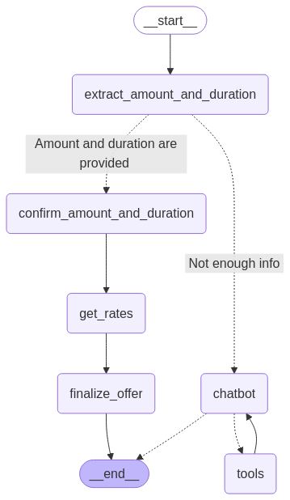

# Сбер - ИИ агент для согласования депозитных ставок

## Функциональные требования

1. Клиенту предоставляется фукционал чата, где комания сообщает объем размещаемых денежных средств и срок размещения.
2. Клиенту сообщается ставка на основании акуальной базы данных депозитных ставок банка.
3. Чат должен уметь общаться с клиентом в свободной форме координируя объем и длительность размещения денежных средств.
4. Перед размещением, клиент должен подтвердить, что ИИ понял объем и срок размещения правильно, или мочь изменить
   данные.

## Граф ИИ агента



## Пример диалога

```bazaar
================================ Human Message =================================

Уточните, пожалуйста, текущие остатки на наших счетах.
================================== Ai Message ==================================

Уточните, пожалуйста, сумму и срок для размещения депозита.
================================== Ai Message ==================================

[{'text': '\n\nЯ помогаю клиентам банка определиться с депозитом. Чтобы получить информацию о возможных ставках, мне нужно знать:\n1. Сколько денежных средств вы планируете разместить? \n2. На какой срок вы хотите открыть депозит? \n\nСообщите, пожалуйста, эти два параметра, и я смогу проверить доступные условия.\n\nЕсли же вас интересует текущий объем свободных денежных средств, я могу помочь это проверить. ', 'type': 'text'}, {'id': 'toolu_01JqctL3c7qRZBLzQfTCSeCg', 'input': {}, 'name': 'get_user_free_cache', 'type': 'tool_use'}]
Tool Calls:
  get_user_free_cache (toolu_01JqctL3c7qRZBLzQfTCSeCg)
 Call ID: toolu_01JqctL3c7qRZBLzQfTCSeCg
  Args:
================================= Tool Message =================================
Name: get_user_free_cache

1000000
================================== Ai Message ==================================

На данный момент у вас имеется 1 000 000 рублей свободных денежных средств, которые потенциально могут быть размещены на депозит. 

Для получения более детальной информации о ставках депозита, пожалуйста, укажите сумму и желаемый срок.
================================ Human Message =================================

Да, давайте разместим всю сумму наших текущих остатов на счетах.
================================== Ai Message ==================================

Уточните, пожалуйста, на какой срок хотели бы разместить 1000000 рублей.
================================== Ai Message ==================================


Для подбора оптимального депозита мне нужно знать период, на который вы планируете разместить средства. 

Сообщите, пожалуйста, желаемый срок депозита:
- Краткосрочный (до 30 дней)
- Среднесрочный (от 31 до 90 дней)
- Долгосрочный (от 91 до 365 дней)

Как только вы укажете срок, я смогу помочь с оформлением депозита на всю сумму 1000000 рублей.
================================ Human Message =================================

Давайте сделаем на 10 дней.
================================== Ai Message ==================================

Понятно, размещение 1000000 рублей сроком на 10 дней. Пожалуйста, подтвердите корректрость данных или скорректируйте.
=============================== User Approval Request ===============================
Name: confirm_amount_and_duration

Пожалуйста, проверьте корректрость суммы и срока депозита.
	 - Размещение 1000000 рублей
	 - Сроком на 10 дней
=============================== Function Message ===============================
Name: confirm_amount_and_duration

Клиент скорректировал данные: {'deposit_amount': 505000}.
=============================== Function Message ===============================
Name: get_rates

Для данных условий размещения текущие ставки 16.4-16.8% годовых. Рекоммендованная ставка 16.4%.
================================== Ai Message ==================================

Вам одобрено размещение 505 000 рублей на 10 дней под 16.4% годовых.
```
