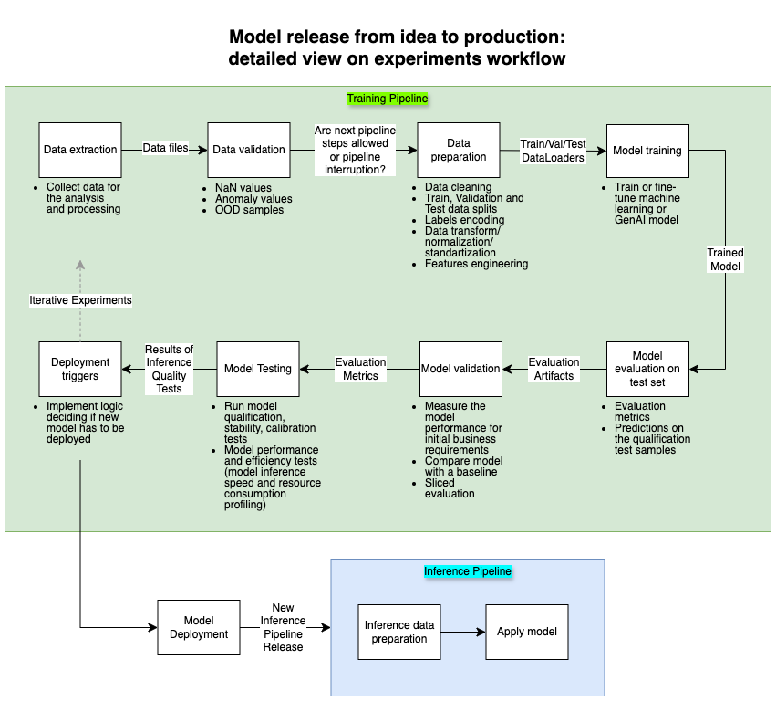
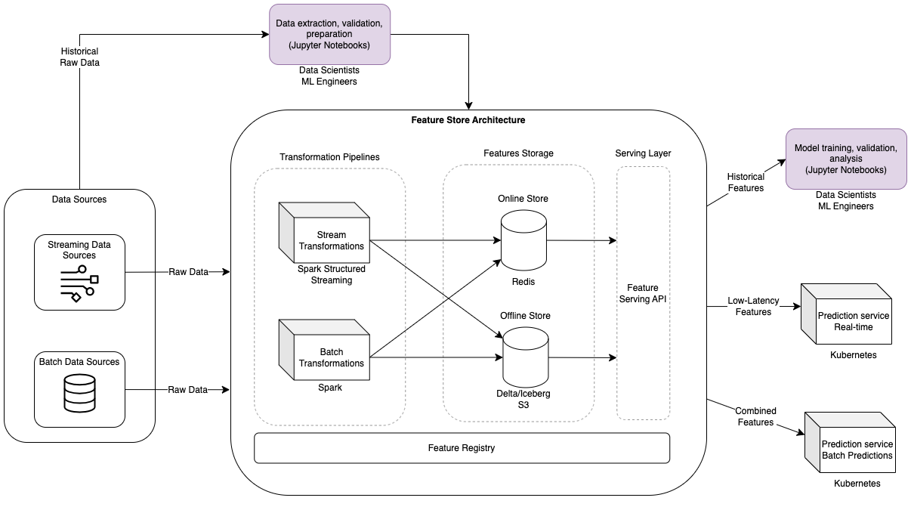
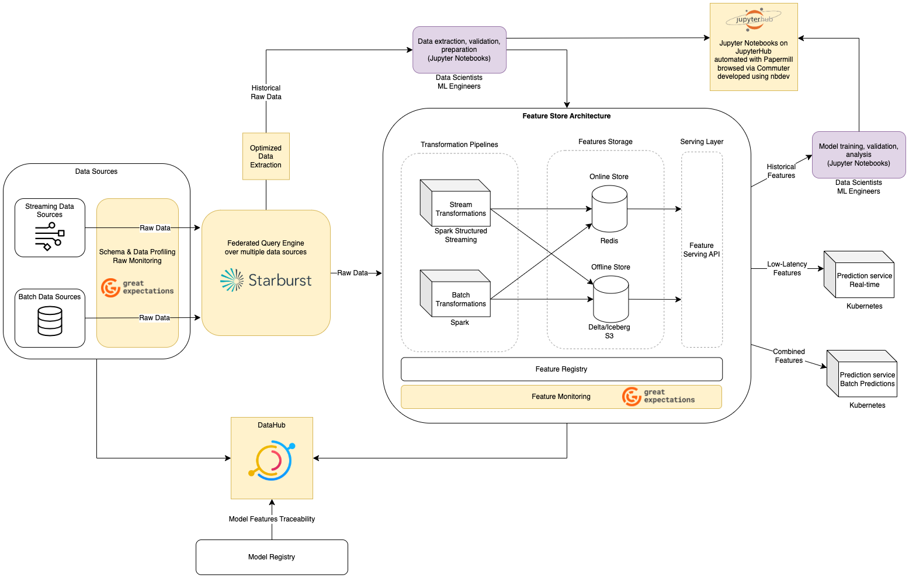
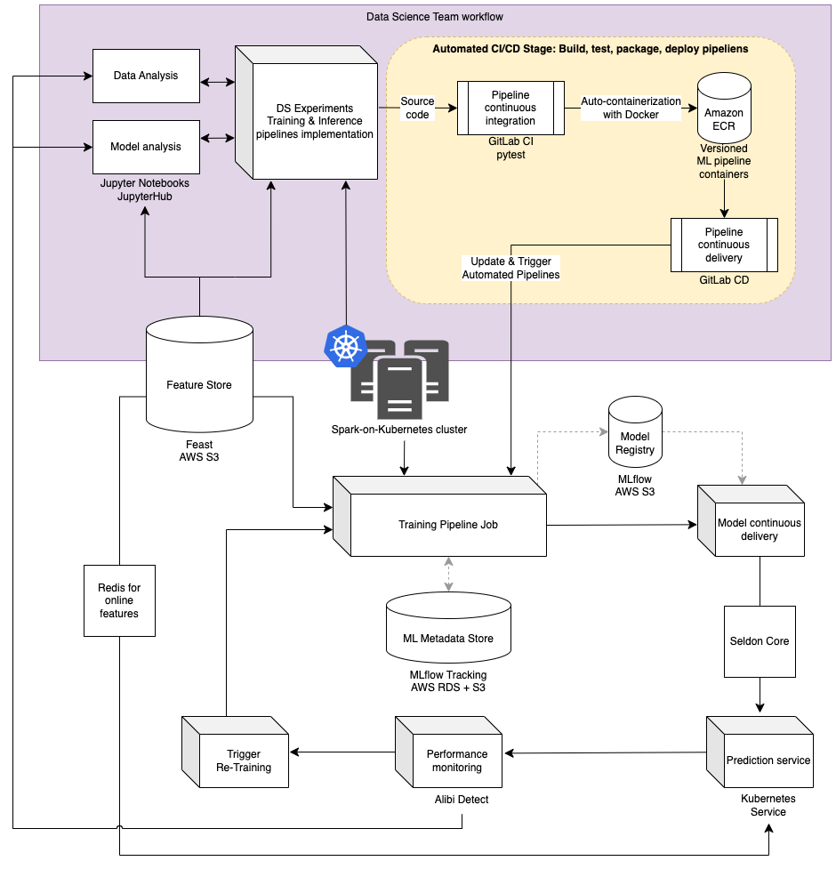
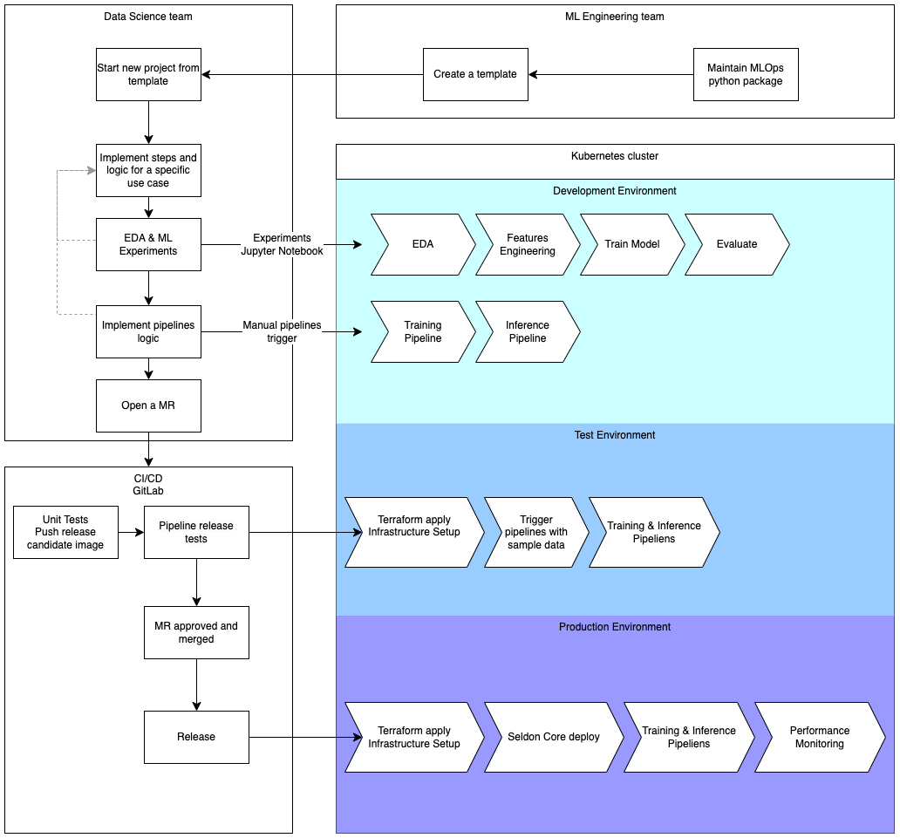
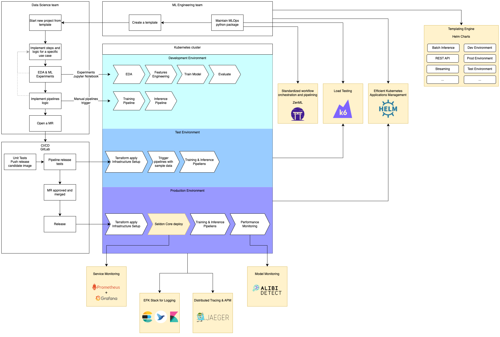
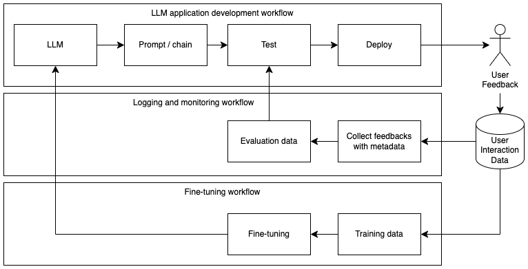
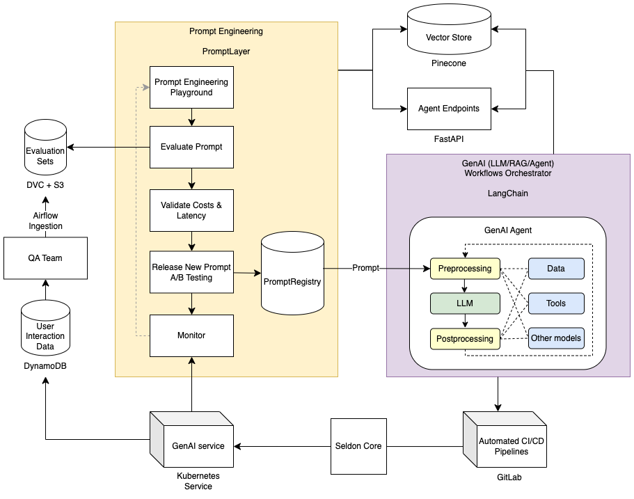
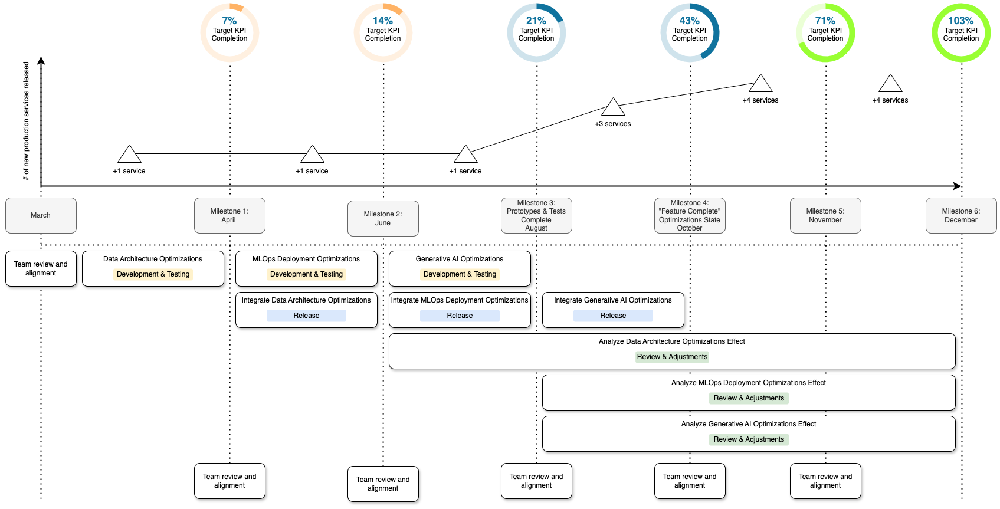

# Functional Requirements

Based on the case study task, I focus on the following requirements:

1. We optimize MLOps architecture for car rental services.
2. Our system has to maintain the following examples of services:
    - Machine Learning Models
        - Demand Forecasting – Predicts rental demand for fleet optimization.
        - Dynamic Pricing – Adjusts rental prices based on demand and availability.
        - Fleet Optimization – Predicts vehicle maintenance needs and optimal distribution.
        - Fraud Detection – Identifies fraudulent bookings and payment anomalies.
        - Recommendation Engine – Suggests personalized rental options.
        - Image & Video Processing – Automates car condition inspection for damage detection.
    - GenAI Models
        - Automated Document Processing – Extracts information from licenses, contracts, and IDs.
        - Conversational AI – AI-powered chatbot for customer support and bookings.
        - Review Summarization – Extracts key insights from customer feedback.
        - Personalized Marketing Content – Generates customized promotions and emails.
        - Multimodal Search (Image + Text) – Enables searching cars using images and descriptions.
3. Final architecture has to optimize speed and reliability of data preparation for exploration and feature
   engineering.
4. Final MLOps architecture has to optimize flexibility and reusability of model pipelines considering that not all
   steps can be perfectly standardized among teams due to high complexity of some models.
5. Final MLOps architecture has to optimize deployment of machine learning model with various complexity (different
   amount of required resources and different model deployment requirements), ensure continuous model performance
   monitoring and continuous model performance improvement.
6. Final MLOps architecture has to consider deployment of novel agentic AI services.
7. For the business planning and monitoring, my solution has to include:
    - A detailed, segmented explanation of how to reduce the time from idea to production for AI and Generative AI
      systems by 75%.
    - A timeline for achieving this result by the end of 2025, including key milestones.
    - A monitoring process for milestone achievements, including KPIs and reporting mechanisms.

# System Requirements

1. Target Cloud provider is AWS.
2. Current architecture already uses Terraform, Kubernetes and Airflow.
3. Final infrastructure design has to consider scalability, stress testing, monitoring, traceability, logging, and other
   necessary operational requirements.

# Design Considerations

## Data Architecture

How do we optimize data preparation needed for data exploration and feature engineering experiments? In order to be able
to answer this question, let us first formulate a structured view on the AI experimentation process.

Now, we focus on the first three steps of the experiments workflow—data extraction, data validation, and data
preparation—where a feature store can help address challenges related to feature management, feature transformation, and
feature consistency.

- How is it relevant for data preparation speed issue? With a Feature Store, the data source and feature
  transformations follow a consistent and easily understandable pattern, fostering the reuse of work across
  teams. => With Feature Stores, one ML team can use another team's features. We can use Feast as our main feature
  store.
- We have to make sure that our data pipelines are optimized for services as well as Data Science / Analytics teams
  can
  experiment with data efficiently. Can we use Medallion or Kappa architecture, which are easier to maintain?
  Based on the assumptions made in [MLOps Functional Requirements](#functional-requirements) section about the
  models our system will have to maintain both - real-time workloads (fraud detection, dynamic pricing) and batch
  workload for heavy optimization (e.g. damages detection or some parts of recommendation engine).
  => We go with Lambda architecture (Consistency << Throughput).
- ETL pipelines will run using Spark within Batch Layer and Speed Layer which will efficiently
  inject the data into the online/offline Feature Store (e.g. Feast) for inference services (we consider using
  online
  features for real-time predictions like pricing and offline features for batch processing like long-term
  embeddings
  for recommendation engine or fleet optimization). For training data we use the offline historical features.

Feature store would be my suggestion number one. However, I assume that feature store is already implemented (as shown
in the graph above), and it alone cannot be considered the complete solution. How can we make it better? I would like to
address the possible improvements in making raw data sources transparent and well-documented for our data scientists as
well as ensure efficient collaboration among engineers. So, how can we achieve improvements?

- **Data Catalog & Discovery Layer**: A data catalog provides a searchable index of available data sources (batch
  and streaming) with metadata, descriptions, and sample data. It enables self-service exploration. For that, we can
  use Amundsen, DataHub, OpenMetadata, Apache Atlas. Implementation approach:
    - Connect these tools to batch sources (e.g., S3, Snowflake, Redshift) and streaming sources (Kafka, Kinesis).
    - Automate metadata ingestion from raw data to feature store using Apache Airflow.
    - Define ownership and documentation policies to keep metadata updated.
- **Schema & Data Profiling Automation**: Since data is evolving, automatic schema inference and profiling help DS
  engineers understand data availability and quality. In particular, it will improve "Data Validation" step (
  referencing to the experiments workflow we designed earlier). Being more specific - we can use such tools like
  Great Expectations or Deequ. Implementation approach:
    - Periodically scan new datasets and generate metadata profiles (column names, types, distributions).
    - Alert data engineers if schema changes unexpectedly.
    - Store schema history and profiling reports in the data catalog.
- **Data Lineage Tracking Integrated with Feature Store**: Data lineage helps DS engineers understand how data flows
  from raw sources to the feature store. This will further accelerate the aspect of well-structured and documented
  feature store and make raw-data vs. already available engineered features transparent. We can use Marquez,
  DataHub, Apache Atlas. Implementation approach:
    - Capture lineage during data ingestion (Airflow DAGs, Spark jobs) and feature engineering.
    - Integrate lineage into the data catalog to show dependencies.
    - Link each feature to its source dataset in the data catalog.
    - Automate feature lineage tracking (e.g., which raw data contributed to which feature).
    - Use MLflow Model Registry to track features used in experiments.
- **Unified Query & Data Access Layer**: DS engineers might spend too much time querying raw data. A unified query
  engine can help them explore batch and streaming data more efficiently. We can use tools like Trino (Presto),
  Starburst, Dremio. Implementation approach:
    - Allow DS engineers to write SQL queries across raw data without worrying about source formats.
    - Expose predefined query templates for common exploration use cases.
- **Optimize Exploratory Data Analysis (EDA) Iterations Speed**: we can additionally address few possible optimizations
  for making exploratory data analysis and features engineering faster based on the already suggested improvements.
    - Enable starburst query pushdown (delegate operations to the underlying database/storage instead of processing them
      in memory).
    - Optimize raw data sources partitioning, replication and sharding (=> faster read queries for analysis).
    - If DS engineers frequently query the same data subsets, we can precompute them using Materialized Views. We can
      then refresh views periodically using Starburst’s auto-refresh or Airflow.
    - Optimize joins using broadcast joins for small tables and enable dynamic filtering for large joins.
    - Leverage caching for fast repeated queries (e.g. enable Starburst’s Query Result Caching).
    - Instead of scanning an entire dataset for experimental features engineering and model training data scientists can
      use sampling.
- **Ensure structured Data Scientists collaboration**
    - Jupyter Notebooks on JupyterHub, automated with Papermill, browsed via Commuter, developed using nbdev.
- **Utilize extra tools for EDA, automatic feature discovery and data visualization**
    - Use Pandas Profiling, YData Profiling and Great Expectations to summarize data.
    - Use Featuretools and TSFresh to generate more features.
    - Use DataHub to browse data.

Thus, we end up with the extended data pipeline optimized for data preparation speed and reliability (changes are
highlighted in yellow).

## Models Lifecycle Operationalization

So far, we have designed and discussed how Data Science team will make experiments efficiently and collaboratively in
order to run AI model experiments efficiently. Business value of any model is created only once the model is
up and running in the production service. Therefore, in this section we will address the initiatives about reducing time
from experimental training and inference pipeline to production. How we can turn this code into the repeatable pipeline
and how this pipeline can go in product in the automated way?

In order to be on the same page as we dive deeper into the separate component and initiatives, let me start with the
assumption that current MLOps pipeline corresponds to
[Google MLOps maturity Level 2](https://cloud.google.com/architecture/mlops-continuous-delivery-and-automation-pipelines-in-machine-learning#mlops_level_2_cicd_pipeline_automation).
It means that our system is able to automate the complete ML-workflow steps without any manual intervention including
automated model monitoring, re-training and deployment.

We want our Data Science team to focus on research and experimentation (purple segment) by minimizing effort on
CI/CD/CT + IaC (yellow segment) in the model lifecycle. Based on my experience, companies use the following patterns for
MLOps <-> DS team collaboration (this is not commonly used definitions/categorization, but rather my way of thinking):

- **Curated Automation**:
    - MLOps engineers are embedded within DS teams during projects. They co-design pipelines, architecture, and
      deployment strategies before transitioning to standard MLOps processes. MLOps engineers handle testing and
      production delivery, with DS support.
    - Pros: Strong cross-functional collaboration (MLOps knows each model's lifecycle), relatively fast
      time-to-production (dedicated MLOps per module), and high flexibility (no strict templates).
    - Cons: MLOps becomes a bottleneck (manual automation per model), lack of standardization, and poor scalability (
      only suitable for a few AI services).
    - Typically used by early-stage startups (MLOps maturity level 0-1) focused on shipping 1-5 core AI models quickly.
- **Automation via Specification**:
    - DS team builds prototypes or initial models without strict constraints, then writes detailed specifications (
      inputs, processing logic, dependencies, outputs) and implements pipeline tests. MLOps takes over integration.
      Model deployment is automated as soon as specification is unchanged. MLOps and DS interact via specification
      templates, MR and CI/CD pipelines.
    - Use Case: Ideal for companies using custom deployment libraries (e.g., C++/C for edge devices) where AI models
      need reimplementation for optimal performance across diverse platforms. Also, suitable for highly complex models.
    - Pros: Maximum flexibility for DS, clear responsibility split, adaptable to any target environment, and handles
      complex models well due to modularity.
    - Cons: MLOps must manually streamline integration with each new spec, increasing time-to-production. Additional
      effort is needed to ensure the production model aligns with the DS prototype (requiring extensive consistency
      tests).
- **Distributed MLOps Templates**:
    - ML Engineering team maintains MLOps python package which allows DS team create templates. Each template is made up
      of a series of pipelines (e.g. ZenML pipelines) consisting of:
        - Python code for pipeline logic (using any third-party libraries and services).
        - A container environment for pipeline execution containing all necessary dependencies.
        - Terraform components.
        - Configuration files.
    - The shared MLOps package includes templates, pipelines & steps, helpers, and CI/CD utilities. By default, the
      template references the methods defined in the ML Engineering space while allowing Data Scientists to create
      custom functions or override the existing functionality.
    - This setup enables rapid prototyping and deployment, scaling the number of deployed models. Fixes or new features
      are released via package updates, instantly available to DS teams.
    - Use Case: Best for dynamic AI applications with many services and experiments, where time-to-production is
      critical.
    - Pros: DS autonomy, AI service scalability, fastest time-to-production.
    - Cons: Risk of misconfiguration by DS teams and requires strong documentation and governance of the MLOps package.

Based on [MLOps Functional Requirements](#functional-requirements), my goal is to minimize time from idea to
production, expecting a high number of models. Therefore, I assume using "Distributed MLOps Templates" approach,
and I will optimize this pattern.

### MLOps Deployment Optimization

- **Model deployment and serving optimization**:
    - It is crucial to ensure model deployment and serving is smooth, mature and flexible even for complex pipelines
      supporting different deployment patterns (batch processing, real-time streaming inference, inference REST APIs).
    - Among available technologies, I would give my preference to Seldon Core as secure, reliable and robust system
      maintained through a consistent security and update policy.
    - Key considerations and responsibilities: flexible deployment patterns, supports A/B testing, canary releases,
      shadow deployments, and multi-model deployments, custom scaling using Kubernetes.
    - Alibi Detect will ensure model monitoring and is a nature choice, since we decided to use Seldon Core.
    - Seldon core will also allow us to use complex inference graphs (e.g., chaining and ensembles).
- **Stress tests before release to production**:
    - How to make high quality stress & load testing before release? We will integrate K6 into the GitLab CI/CD for
      automated load testing. For high reliability system, we can integrate load testing in both - CI/CD pipeline of
      MLOps python package releases (to ensure that our templates architecture is scalable) and for CI/CD pipeline of
      the specific AI model deployment.
- **Efficient Kubernetes Applications Management**:
    - Utilize templating engine Helm in MLOps python package for releasing from templates. Helm will template Kubernetes
      resources to streamline deployment and configuration based on the used template.
- **Standardized workflow orchestration and pipelining**:
    - We can use workflow orchestration and pipelining tools like ZenML for managing complex ML workflows over the
      different templates.
- **Application Performance Monitoring (APM)**:
    - We can use Jaeger for distributed tracing (tracing requests across microservices and understanding bottlenecks).
- **Logging**:
    - EFK Stack (Elasticsearch, Fluentd/Fluent Bit, Kibana) for centralized and aggregated logs from production
      environment. Implementation approach:
        - Fluent Bit/Fluentd collects logs from Seldon pods and Kubernetes system components.
        - Elasticsearch stores logs and enables querying.
        - Kibana visualizes logs and creates dashboards for Seldon Core and the entire Kubernetes ecosystem.

#### Optimization Approaches - Summary

- Scalability: Seldon Core -> Kubernetes HPA!
- Stress testing: K6
- Model monitoring: Model performance monitoring and requests logging with Alibi Detect integration
- Service monitoring: Prometheus supported by Seldon Core with Grafana dashboard (including alerting using Prometheus
  Alertmanager)
- System monitoring and tracing: Jaeger
- Logging: Seldon Core logging integration with Elasticsearch (full auditing through model input-output request)

## Generative AI

Finally, we have to address the last technical requirement
from [MLOps Functional Requirements](#functional-requirements): Generative AI and agentic AI services.
Again, as for the previous sections, I will try to describe my ideas and approaches on multiple system levels.

Let's start from the LLM application workflow graph to consider all aspects on the low level.

How do we develop system level components and deploy GenAI services?

- **Test-driven prompt engineering**:
    - The key component of every generative AI and agentic service is prompt engineering. My systematic view on prompt
      engineering in different companies can be formulated in the following maturity levels:
        - Level 0: Prompt engineering directly in OpenAI API/UI (manual, no structure or tracking).
        - Level 1: Prompt engineering in Git (either directly in the pipeline code or in a separate Git repository).
        - Level 2: Prompt engineering in specialized tools decoupled from code (including prompt versioning, pre-release
          evaluations, parallel evaluations for multiple prompt variations to accelerate experiments, prompt tracking
          and performance monitoring over time, decoupling prompt changes from deployments, involving non-technical
          stakeholders if necessary, and clear cost and latency considerations before release).
    - To achieve level 2, we can leverage tools like PromptLayer. As GenAI frameworks evolve rapidly, numerous promising
      projects are emerging (e.g., agenta.ai). Therefore, it's crucial to continuously monitor this field to identify
      the best tools or even consider developing an in-house solution if necessary.
- **Evaluation-driven development**:
    - It is crucial to incorporate continuous generative AI improvement and monitoring. We must ensure a systematic
      approach to developing GenAI applications through user- and feedback-driven pipelines. My vision is that user
      interaction data should be collected for further review by the QA team, what will allow to growth an evaluation
      dataset and continuously integrate feedbacks into the monitoring and prompt engineering processes.
    - Evaluation types to consider: regular ML evaluation metrics, reference matching metrics, LLM-based preference
      ratings, human-in-the-loop metrics, keyword-based or other static metrics.
- **Workflows building framework**:
    - We can utilize Langchain as a building applications using LLMs. It acts as an orchestrator that enables developers
      to create complex workflows and agents by chaining together prompts, models, APIs, data sources, and logic.

So, my final architecture for generative AI services is show on the graph below.

## AI & GenAI Acceleration Roadmap

Summary of the initiatives to develop and integrate (ordered):

- **Data Architecture Optimizations**:
    - DataHub: data catalog & tracking (data sources -> feature store -> model registry)
    - Great Expectations: raw data schema and profiling monitoring with
    - Starburst: unified query & data access layer
    - Great Expectations: features monitoring
    - Initiatives for Jupyter Notebooks: JupyterHub, Papermill, Commuter, nbdev
    - Experiments data extraction optimization
- **MLOps Deployment Optimizations**:
    - ZemML: pipelines orchestration
    - EFK: logging
    - Jaeger: distributed tracing and APM
    - Helm: applications management
        - Helm Charts: templates for test and prod environments
    - Seldon Core: models deployment and serving
        - Prometheus and Grafana: Seldon Core services monitoring
        - Alibi Detect: models monitoring
    - K6: load testing
- **Generative AI Optimizations**:
    - PromptLayer: aggregated, versioned and systematic prompt engineering
    - GenAI QA processes for continuous evaluation sets improvement

### KPIs Tracking

- My assumption is that historically, average time from idea to production for one feature is 3 months (90 days)
- Aim is to reduce this time is 75% => 90 days * 25% = 22 days per service
- Time constrain: 10 months (~300 days) until the end of the year (March 2025 - January 2025)
- Target is to release 300 / 22 = 14 new features

### Roadmap

