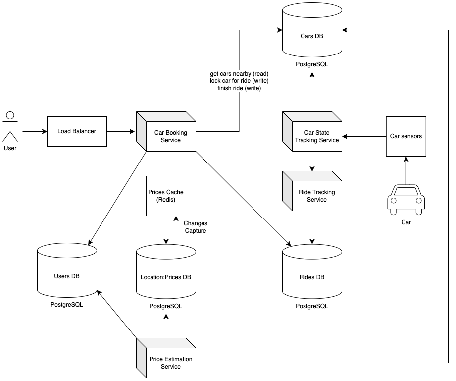

# SIXT

SIXT SE is a leading international provider of premium mobility services, headquartered in Pullach, Germany. Founded in
1912, the company operates in over 100 countries, offering a range of services including car rental (SIXT rent), car
sharing (SIXT share), ride-hailing (SIXT ride), and car subscriptions (SIXT+). These services are integrated into a
single platform, providing customers with flexible and convenient mobility solutions.

In this system design we focus on the **SIXT share** (car sharing) app design.

## Functional Requirements

1. User should see all closest vehicles on the map.
2. Before renting the car, user should see the price per minute of car renting.
3. Prices are dynamic and depend on demand (we assume price multiplier depending on the predicted traffic in the area).
4. Once user accepts renting a car no other user is allowed to rend the same car until it is returned.
5. At the end of the road user pays based on time and ride distance.
6. Every car sends data about gps location every 3 seconds.

## System Requirements

1. Target cloud platform is AWS.
2. Ride time and distance must be accurate (for distance it means continuous GPS location tracking).
3. Our main goal for the AI model is to achieve the highest accuracy in demand forecasting. For the inference
   (on the API level) this model takes location and day as main inputs for the inference and outputs the number of rides
   per hour for the next day.
    - System must track where and when the rides were booked.
    - MLOps pipeline must ensure continuous model performance monitoring and improvement.

## Capacity Estimation

1. Everyone in the world takes a 1-hour ride once per week.
2. If a ride is 1-hour long, there are 24 * 7 ~ 200 slots per week.
3. The current world population is 8 billion people => 8 billion / 200 slots = 40 millions rides going on at a time.
4. If we want to track locations of 40 millions cars, it is
   40 millions * (64-bit latitude coordinate + 64-bit longitude coordinates + 64-bit car id) ~ 1 GB.
5. 40 millions rides / 60 minutes ~ 700K requests per minute or 12K requests per second.

## Design Considerations

### Finding a car

1. In order to quickly find cars in say 1 km radius, I would suggest to use geospatial indexing for all stationary
   cars (that are not currently booked for a ride). This is done by encoding the latitude and longitude into the score
   of the sorted set using the geohash algorithm.
2. Which database to use? It critical to ensure the consistent status and of every car, when users will book the cars
   for the ride. Therefore, we can't go with multi-leader or leaderless replication databases
   => I would suggest to use PostgreSQL.
    - Partitioning: Geographic partitioning between available cars seems to be a good strategy. Few additional
      considerations:
        - Some regions (e.g., city centers) will have high-density cars, while others (e.g., rural areas) will be sparse
          or empty. We will have to consider this for region-based partitioning to avoid overloaded partitions in
          high-density areas (slow queries) and wasted space in low-density regions (empty partitions).
        - There can be many cars in the region that are currently booked (active ride cars). We don't need to optimize
          those cars for quick reads when user wants to see available cars for the booking a new ride. So, we can
          further optimize read queries by car status partitioning (available cars vs. booked cars) - nested partition
          in each region.
3. We expect user to spend up to 5 minutes in the app before booking a car or closing the app. During this time we
   have to provide good user experience and continue showing available cars and stop showing already booked cars.
   Therefore, we cache available cars in the car booking service and use change data capture in order to updatae list of
   available cars if some cars got booked or were returned are now available for new booking.
4. In order to prevent multiple users booking the same car successfully we will use PostgreSQL row-level locks.

### Tracking a ride distance

1. In order to track ride distance accurately, we collect real-time updates from gps trackers on the car and aggregate
   total distance in the Rides database.
2. We ensure that processing of the total distance is reliable and scalable by using Kafka queues.

### Demand Prediction Model

1. Our labels are the number of rides in the given location from the past. We get this data directly from our Rides DB
   which stores time and location of the ride start.
2. Our main input features are encoded location and time.
3. We deal with time series. Do we expect seasonality? Yes, demand on the cars will definitely depend on the hour, day
   of week and month of year. So, we do have seasonality trends (seasonal variation).
3. Also, we consider that our system will be more robust with
   multiple different extra features, e.g. predicted weather and expected events (we can engineer these features from
   the third-party sources).
3. The input data can be represented as following:
    - Hour of Day: `hour_sin = sin(2 * pi * (hour / 24))` and `hour_cos = cos(2 * pi * (hour / 24))`
    - Day of Week: `dow_sin = sin(2 * pi * (dow / 7))` and `dow_cos = cos(2 * pi * (dow / 7))`
    - Month of Year: `month_sin = sin(2 * pi * (month / 7))` and `month_cos = cos(2 * pi * (month / 7))`
3. Auto-regressive trend (company is growing, getting more popular)
4. How to normalize data?

### Data Cleaning

1. Which problems with the data can we expect?
    - Our targets are not 100% reliable, because number of rides also depends on number of available cars in the area.
      If all cars in the area were booked (or no cars are available), then our rides DB will not contain more rides than
      there were cars in this area. How to consider this?

### New Region Problem

1. How do we start predicting demand in a completely new area (without historical data in this area)?

### Data Split

1. Training data: auto-regressive windows
2. Test data: last 7 days in every location OR time-wise cross validation (last 7 days, last month, last 6 months)

## Final Design Graph

