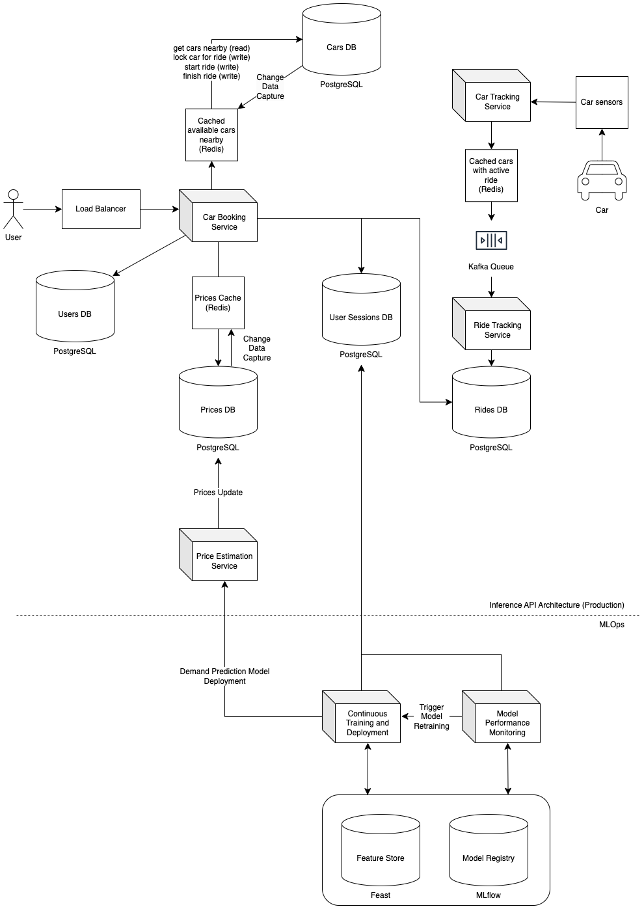

# SIXT

SIXT SE is a leading international provider of premium mobility services, headquartered in Pullach, Germany. Founded in
1912, the company operates in over 100 countries, offering a range of services including car rental (SIXT rent), car
sharing (SIXT share), ride-hailing (SIXT ride), and car subscriptions (SIXT+). These services are integrated into a
single platform, providing customers with flexible and convenient mobility solutions.

In this system design we focus on the **SIXT share** (car sharing) app design.

## Functional Requirements

1. User should see all closest vehicles on the map.
2. Before renting the car, user should see the price per minute of car renting.
3. Prices are dynamic and depend on demand (we assume price multiplier depending on the predicted traffic in the area).
4. Once user accepts renting a car no other user is allowed to rend the same car until it is returned.
5. At the end of the road user pays based on time and ride distance.
6. Every car sends data about gps location every 3 seconds.
7. The SIXT share office needs to know the optimal number of car allocations for each hour of the following day to
   efficiently plan to relocate vehicles from low-demand areas to high-demand areas.

## System Requirements

1. Target cloud platform is AWS.
2. Ride time and distance must be accurate (for distance it means continuous GPS location tracking).
3. Our main goal for the AI model is to achieve the highest accuracy in demand forecasting. For the inference
   (on the API level) this model takes location and day as main inputs for the inference and outputs the most likely
   locations for start of new rides per hour for the next day. MLOps pipeline must ensure continuous model performance
   monitoring and improvement.

## Design Considerations

### Finding a car

1. In order to quickly find cars in say 1 km radius, I would suggest to use geospatial indexing for all stationary
   cars (that are currently not booked for a ride). This is done by encoding the latitude and longitude into the score
   of the sorted set using the geohash algorithm.
2. Which database to use? It critical to ensure the consistent status and of every car, when users will book the cars
   for the ride. Therefore, we can't go with multi-leader or leaderless replication databases
   => I would suggest to use PostgreSQL.
    - Partitioning: Geographic partitioning between available cars seems to be a good strategy. Few additional
      considerations:
        - Some regions (e.g., city centers) will have high-density cars, while others (e.g., rural areas) will be sparse
          or empty. We will have to consider this for region-based partitioning to avoid overloaded partitions in
          high-density areas (slow queries) and wasted space in low-density regions (empty partitions).
        - There can be many cars in the region that are currently booked (active ride cars). We don't need to optimize
          those cars for quick reads when user wants to see available cars for the booking a new ride. So, we can
          further optimize read queries by car status partitioning (available cars vs. booked cars) - nested partition
          in each region.
3. We expect user to spend up to 5 minutes in the app before booking a car or closing the app. During this time we
   have to provide good user experience and continue showing available cars and stop showing already booked cars.
   Therefore, we cache available cars in the car booking service and use change data capture in order to update list of
   available cars if some cars got booked or got available for new ride.
4. In order to prevent multiple users booking the same car successfully we will use PostgreSQL row-level locks.

### Tracking a ride distance

1. In order to track ride distance accurately, we collect real-time updates from gps trackers on the car and aggregate
   total distance in the Rides database.
2. We ensure that processing of the total distance is reliable and scalable by using Kafka queues.

### Demand Prediction Model

1. What is the main purpose of this model? In order to solve the given business task I formulate the problem statement
   as following: predict a **heatmap** of where and when we expect the most bookings of the
   rides to happen to avoid the scenario when at demand hotspots we don't have enough cars. For example, if we expect
   start of summer holidays we will want to allocate enough cars close to airports so that families arriving for the
   vacation would have enough cars to book. Or, if there is a big sport even in a city - we want to allocate enough cars
   close to the football stadion to ensure that all football fans will be able to take our cars for car sharing after
   game.
2. Model inputs: encoded location and time (daily, weekly, monthly seasonality to expect - Fourier features). Also, we
   will have to consider multiple different extra features, e.g. predicted weather, expected events, region population,
   public transport accessibility, active ad campaigns in this location like posters or SIXT office (we can engineer
   these features from the third-party sources).
3. Model outputs: optimal number of cars allocation tomorrow within selected region (e.g. Munich region grid divided by
   1 km spatial grid). Not clear yet how exactly to represent the target data - we address this question in the next
   point.
4. What is our data source for training and evaluation of the AI models? We can get information about ride start time
   and location from Rides DB and optimize model to predict absolute number of rides per area within a region.
    - Do we have some problems when designing the model to predict this target? I tend to say yes - there are problems:
      if we predict number of rides, our targets are not 100% reliable, simply because number of rides also depends
      on number of available cars in the area. If there are no available cars in this area (e.g. all cars in this
      area are taken), then our model will learn that there was no interest in car sharing at this time (=wrong
      target). Can we do better? Yes. If we log all user sessions with location and optimize model to predict number
      of users looking for a ride instead of number of rides taken. With this design, our system is not restricted by
      number of available cars in this area. Of course the risk to be too positive - not all users looking for a ride
      will actually take the car, but I think it is still reasonable (in the scenario of car-sharing service) to target
      that we want all users in a system to be able to book a ride. So, we go with this approach as the most reasonable
      from the business point of view.
    - Assuming that from now on we will predict number of users looking for a ride, there is another problem I would
      expect - absolute number of users to predict might be not optimal. First, our model will have to capture all the
      non-homogeneous trends to scale predictions properly. The trends might be hard to predict in terms of absolute
      numbers. Can we do better? Yes, we can predict normalized demand density heatmap. This will be a valid design
      considering that we want to optimize cars allocation within a region and will have certain not-elastic
      (=we can't quickly double the amount of available cars in the city when needed) number of vehicles in
      a region. Thus, for practical purposes (we still want to know how many cars we want to allocate when) we can
      simply multiply number of available cars in the region by the predicted normalized heatmap to know the optimal
      allocation of the cars.
    - If we want to optimize service on the global level (assuming that periodically, say once
      per month, our employees will have to relocate cars between the regions, e.g. between Berlin and Potsdam), then we
      can use the same demand density heatmap strategy on the global level (where we predict normalized demand
      distribution among regions instead of areas of the same region). So, I see it as a valid design and think we
      should optimize model for that.
5. How do we start predicting demand in a completely new area (without historical data in this area)?
    - Start simple: allocate cars in the most meaningful places from the business point of view (e.g. train stations and
      airports).
    - Over time, we track user sessions and know if they are looking for a ride in some location. So, even if our
      initial distribution is not optimal - we will quickly adapt.

## MLOps Workflow Graph

1. Following our design considerations so far, we consider ingesting data from User Sessions DB for training and
   inference (also for inference because of the lagging features). We can trigger re-training model automatically every
   time when there is new data available. I suggest implementing MLOps pipelines using
   ZenML (e.g., with Kubernetes orchestrator), with MLflow for experiments tracking and Apache Spark for efficient batch
   processing of large datasets during preprocessing and feature engineering.
2. We deploy model into the production for Price Estimation Service. Based on our design, AI model inference
   pipeline must be able to access user sessions data from yesterday in order to calculate lagging features.
3. We will re-evaluate models daily as we get data from the last 24 hours. So, we can detect model performance
   degradation based on re-evaluation results. We automate monitoring with ZenML pipeline.
4. We can optionally utilize Evidently AI library to detect data drift and feature drift to trigger model re-training
   even if evaluation metrics of the current production model doesn't indicate about the performance degradation.
5. If we need, we can visualize system metrics over the past weeks in the Streamlit dashboard to have a custom and
   interactive visualization of our system performance.

## AWS Components

1. We will aim to run our product services inside a containers, what gives us the full control and makes scaling
   straightforward.
2. Let's start with Car Booking Service which is the central user API, where user can see, book, finish and pay rides.
    - Maybe first question to ask: do we need websocket for a car booking service? Even though multiple sources I read
      suggest this as a good practise, I don't see a strong need in establishing a websocket connection with users,
      because some reasonable delay in signals for booking or returning a car doesn't have a very significant impact on
      the user experience from my point of view in our case.
    - Considering that we are probably okay just to have a normal REST API for communication with user, I would suggest
      to implement Car Booking Service with FastAPI. Speed and scalability is critical here and, we make system design
      for already large-scale app. Therefore, I would go with AWS EKS (Kubernetes) even though deployment complexity is
      high. As a note, next best alternative would be AWS Fargate Elastic Container Service (ECS). If we design a
      startup MVP, I would go with AWS App Runner for easiest fully managed solution.
3. For Cars/Users/Prices/Rides databases, we will use Postgres SQL as discussed earlier, which we run on Amazon Aurora,
   since
   we need strong consistency, ACID transactions for booking the cars and CDC (Change Data Capture) for updating the
   data.
4. For User Sessions database, I would prefer using Dynamo DB for logging user sessions, where write throughput and
   scalability is more important than read latency and, it doesn't need to be strongly relational database.
5. For MLOps, we are already using EKS, it makes sense to keep ZenML orchestration inside EKS rather than using AWS EMR
   or SageMaker. For large datasets - we can run Apache Spark on EKS. We will use MLflow Tracking and Model Registry +
   Feast feature store as it is natively supported in ZenML. Finally, we use Seldon Core to deploy AI models.

## Final Design Graph

## References

- https://youtu.be/giwa8Hc0niY?si=jnA7PAWKNSmXZxiZ
- https://www.kaggle.com/competitions/store-sales-time-series-forecasting
- https://www.kaggle.com/competitions/rossmann-store-sales
- https://mediatum.ub.tum.de/doc/1482032/188217268247.pdf