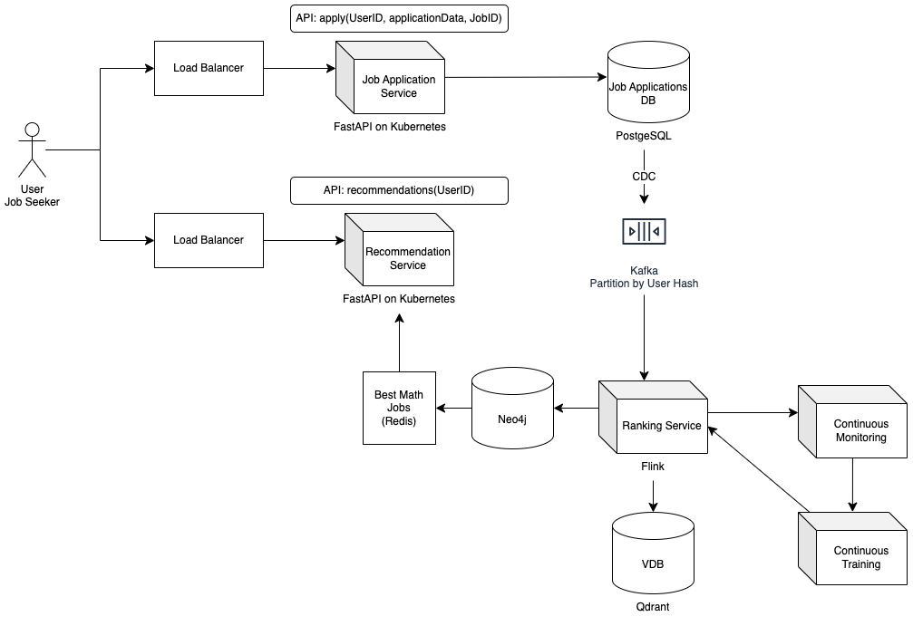

# Functional Requirements

1. We are designing a recruitment platform that helps talents find jobs and apply based on their profiles, including
   their resumes.
2. Our system must provide relevant job recommendations to candidates based on the jobs they have already applied to.
3. The recommendation engine must consider both the user's profile and their activity (applied jobs).

# System Requirements

1. Utilize a graph database.
2. The system must support Context-Aware and Session-Based Recommendations.
3. Additionally, the system should be extendable to Collaborative Filtering and Content-Based Filtering recommendation
   engines.

